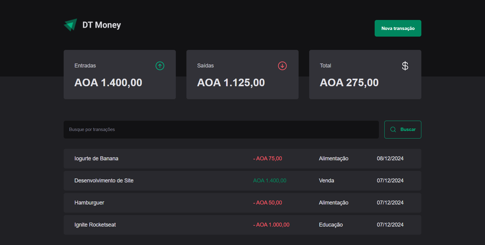

# DT Money 

Financial control application developed in module 03: API consumption and performance in ReactJS

# Layout 

# 🛠️ Tecnologies
<li>Vite + React.js</li>
<li>Typescript</li>
<li>React Hook Forms</li>
<li>React Router Dom</li>
<li>Styled-components</li>
<li>Form validation with zod</li>
<li>Axios and JSON Server</li>

# 🚀 How to start ?
1- install node.js on your computer

>Clone repository
git clone https://github.com/usuario/nome-do-projeto.git

Browse to project folder
> cd project-name

Install dependencies
> npm install

Execute the project
> npm run dev

# 📚 Functional requirements
- Create Transactions 
- Views created Transactions 
- Filter created transactions 
- Views Summary Transactions 
- Optmization of the components 
